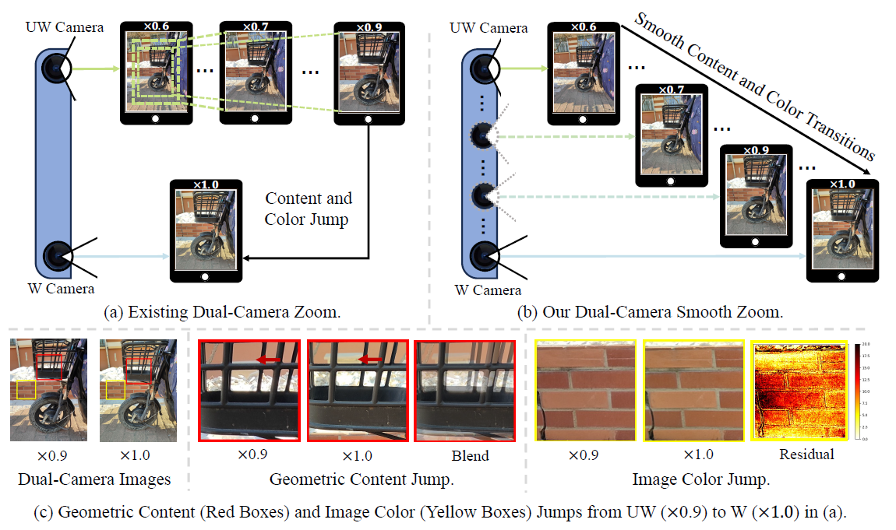
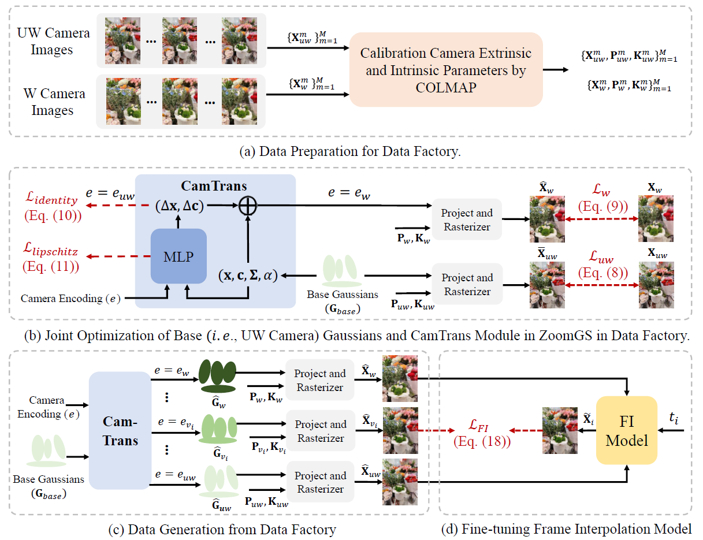

# DCSZ (ECCV 2024)
PyTorch implementation of [**Dual-Camera Smooth Zoom on Mobile Phones**](http://arxiv.org/abs/2404.04908.pdf)


[](http://arxiv.org/abs/2404.04908.pdf)
[](https://dualcamerasmoothzoom.github.io/)


## News
- 🔥 Data for ZoomGS and fine-tuning FI models is now available.  
- 🔥 Codes and pre-trained models are now available.


## 1. Abstract
<p align="center"></p>
When zooming between dual cameras on a mobile, noticeable jumps in geometric content and image color occur in the preview, inevitably affecting the user's zoom experience. 
In this work, we introduce a new task, \ie, dual-camera smooth zoom (<strong>DCSZ</strong>) to achieve a smooth zoom preview. 
The frame interpolation (FI) technique is a potential solution but struggles with ground-truth collection. To address the issue, we suggest a data factory solution where continuous virtual cameras are assembled to generate DCSZ data by rendering  reconstructed 3D models of the scene. 
In particular, we propose a novel dual-camera smooth zoom Gaussian Splatting (<strong>ZoomGS</strong>), where a camera-specific encoding is introduced to construct a specific 3D model for each virtual camera. With the proposed data factory, we construct a synthetic dataset for DCSZ, and we utilize it to fine-tune FI models. 
In addition, we collect real-world dual-zoom images without ground-truth for evaluation. 
Extensive experiments are conducted with multiple FI methods. 
The results show that the fine-tuned FI models achieve a significant performance improvement over the original ones on DCSZ task. 


## 2. Method

<p align="center"></p>

Overview of the proposed method. (a) Data preparation for data factory. We collect multi-view dual-camera images and calibrate their camera extrinsic and intrinsic parameters. (b) Construction of ZoomGS in data factory. ZoomGS employs a camera transition (CamTrans) module to transform the base (i.e., UW camera) Gaussians to the specific camera Gaussians according to the camera encoding. (c) Data generation from data factory. The virtual (V) camera parameters are constructed by interpolating the dual-camera ones, and are then input into ZoomGS to generate zoom sequences. (d) Fine-tuning a frame interpolation (FI) model with the constructed zoom sequences.

## 3. Prerequisites and Datasets

### 3.1 Prerequisites
- Python 3.7.13, PyTorch 1.12.1, **cuda-11.8**
- opencv, numpy, Pillow, timm, tqdm, scikit-image
- We provide detailed dependencies in [`environment.yml`](environment.yml)

### 3.2 Datasets
Please download data from Baidu Netdisk (Chinese: 百度网盘).
- Dataset for zoomGS: https://pan.baidu.com/s/1tZ326PQ7SI_LoDAMreXbBQ 提取码: xje3 
- Dataset for FI: https://pan.baidu.com/s/1rIaAc2Huprl796qguiB8AQ 提取码: w4zf 

### 3.3 Pretrained models
- Pretrained model link: https://pan.baidu.com/s/1_bfNrij8HwtwlON32TiCWg?pwd=x66g 提取码: x66g 

- Please put the above models into './FI/pretrained_dirs'

- Fretrained model link: https://pan.baidu.com/s/1QeuSrRo4E5dIEMNGiJRLiw 提取码: hya8 

- Please put the above models into './FI/ckpt'

## 4. Quick Start for ZoomGS
- Run [`cd ./ZoomGS`](./ZoomGS)
- Run [`bash ./zoomgs_train.sh`](./zoomgs_trains.sh)

## 5. Quick Start for Frame Interpolation
- Run [`cd ./FI`](./FrameInterpolation)
- Training: run [`bash ./train.sh`](./train.sh)
- Testing on synthetic data: run [`bash ./test_syn.sh`](./test_syn.sh)
- Testing on real-world data: run [`bash ./test_real.sh`](./test_real.sh)

## 6. ZoomGS Results
<table>

   <colgroup>
    <col style="width: 33%;">
    <col style="width: 33%;">
    <col style="width: 33%;">
  </colgroup>

  <tr> 
     <td>
          <center>UW Image (x0.6)</center>
    </td>
     <td>
          <center>W Image (x1.0)</center>
    </td>
     <td>
          <center>Dual-Camera Smooth Zoom (x0.6->x1.0)</center>
    </td>
  </tr>
  <tr>
    <td>
       
    </td>
    <td>
      
    </td>
    <td>
      
    </td>
  </tr>

  <tr>
    <td>
       
    </td>
    <td>
      
    </td>
    <td>
      
    </td>
  </tr>


</table>


## 7. FI Results

#### 7.1 Quantitative comparisons of FI models on the synthetic dataset and real-world dataset.
<p align="center"></p>

#### 7.2 Visual comparisons on the synthetic dataset.
<p align="center"></p>

#### 7.3 Visual comparisons on the real-world dataset.
<p align="center"></p>


## Acknowledgement

Special thanks to the following awesome projects!

- [Gaussian-Splatting](https://github.com/graphdeco-inria/gaussian-splatting)
- [FSGS](https://github.com/VITA-Group/FSGS)
- [BAD-Gaussian](https://github.com/WU-CVGL/BAD-Gaussians)
- [RIFE](https://github.com/hzwer/ECCV2022-RIFE)


## Citation
If you make use of our work, please cite our paper.
```bibtex
@article{DCSZ,
  title={Dual-Camera Smooth Zoom on Mobile Phones},
  author={Wu, Renlong and Zhang, Zhilu and Yang, Yu and Zuo, Wangmeng},
  journal={ECCV},
  year={2024}
}
```
